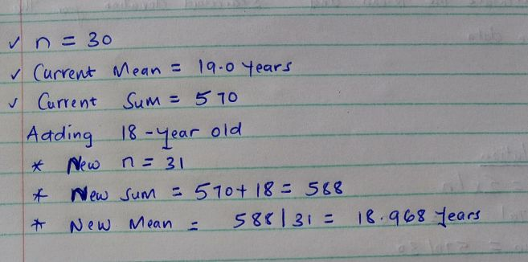
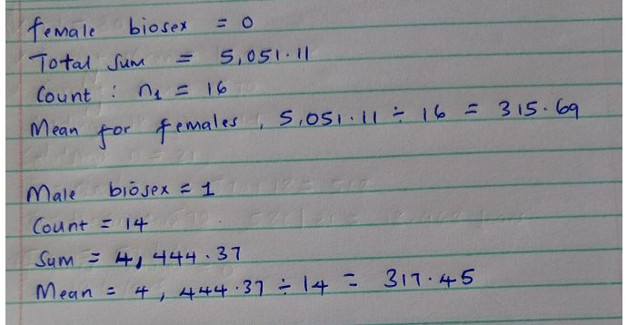
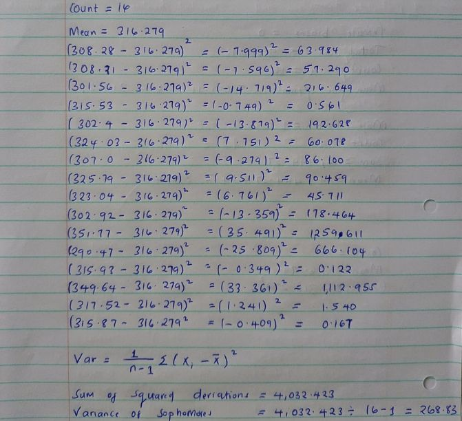
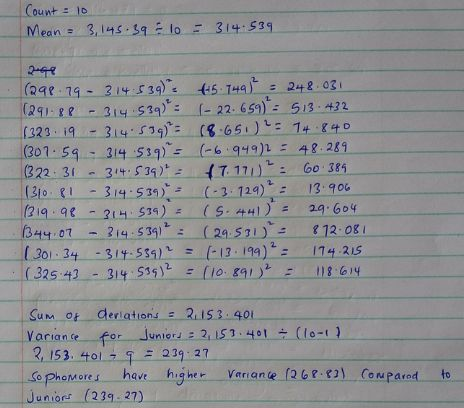
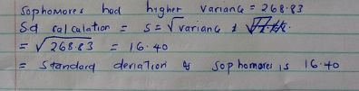

```{r setup, include=FALSE}
knitr::opts_chunk$set(echo = TRUE)
```


## Data Overview

```{r}
data <- read.csv("HW2 .csv")
head(data)
```

---

## 1. Calculate the mean and the standard deviation for the Age variable


---

## 2.If you add another 18 year old to the sample, what happens with the mean? Why would this happen?




### When adding a value below the current mean, it pulls the average down toward the new value, resulting in a lower overall mean.

---

## 3. Determine if females (coded as 0) or males (coded as 1) have a higher mean Score




---

## 4. Determine if Sophomores (coded as 2) or Juniors (coded as 3) have a higher variance on the Score variable
### Sophomores classrnk = 2

---

### Juniors (ClassRnk = 3) - Scores


---


---

## 5. What is the standard deviation for the group that was higher in question 4?



---

